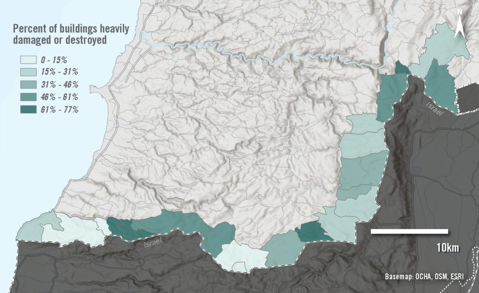

---
hide:
  - toc
---

# Nowhere to Return: Israel's Extensive Destruction of Southern Lebanon

## Overview

Using satellite imagery analysis and digital verification methods, this project documents the extensive destruction of civilian structures and agricultural land carried out by the Israeli military across 26 municipalities along Lebanon's southern border between October 2024 and January 2025, providing evidence for Amnesty International's assessment of potential violations of international humanitarian law.

**Study Area:** Southern Lebanon — 26 municipalities along the Israeli border  
**Duration:** October 2024 – August 2025  
**Role:** Contributor  
**Status:** Completed

---

## Methods & Tools

**Data Sources**

- Sentinel-2 multispectral satellite imagery (initial damage flagging)
- High-resolution commercial satellite imagery (detailed building damage assessment)
- Humanitarian OpenStreetMap Team (HOT) open-source building footprint data
- Armed Conflict Location & Event Data (ACLED) armed conflict database
- Social media videos and photos (77 verified by the Evidence Lab)
- Interviews with 11 residents of southern Lebanese border villages

**Processing Steps**

1. Used Sentinel-2 imagery with a change detection algorithm to identify areas with significant structural changes between 26 September 2024 and 30 January 2025
2. Conducted detailed building damage assessment using high-resolution imagery, manually reviewing and correcting algorithmic results against HOT building footprint data
3. Verified 77 videos and images published by Israeli soldiers, activists and media using satellite imagery matching, shadow analysis and weather pattern cross-referencing
4. Overlaid building damage data with Israeli troop advance polygons and ACLED conflict event data to establish timeline and context of destruction
5. Calculated percentage of heavily damaged or destroyed structures per municipality relative to total structure count

**Tools Used**

| Tool | Purpose |
|------|---------|
| ArcGIS Pro | Change detection analysis and cartographic outputs |
| Sentinel Hub | Sentinel-2 imagery access and processing |
| Google Earth Engine | Large-scale imagery analysis |
| QGIS | Geospatial data review and refinement |
| HOT OSM Building Footprints | Baseline structure count per municipality |

---

## Key Findings

- 10,803 structures were severely damaged or destroyed across 26 border municipalities in a four-month period
- In three municipalities — Yarine, Dhayra, and Boustane — over 70% of all structures were heavily damaged or destroyed
- Seven additional municipalities had more than 50% of their structures destroyed
- Most destruction was carried out using manually laid explosives and bulldozers, indicating it occurred while Israeli forces were in control of the areas and outside the context of active combat
- 58% of agricultural assets in Nabatieh district were destroyed, with similar figures in Tyre (52%) and Bint Jbeil (33%), according to a UNDP impact assessment
- The two municipalities with the least destruction (under 5%) were majority Christian villages; the most affected were majority Shia Muslim

---

## Links

[Read the Full Report](https://www.amnesty.org/en/latest/research/2025/08/israel-lebanon-extensive-destruction/){ .md-button }
